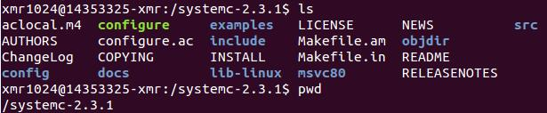
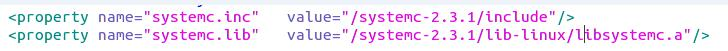
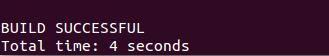
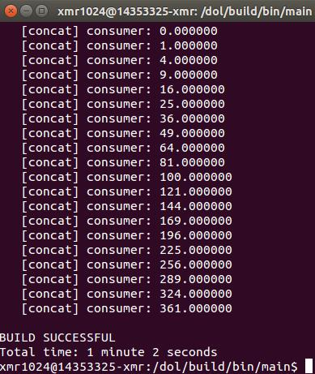

# Distributed Operation Layer #

**分布式操作层(Distributed Operation Layer)**是一个给并行应用程序编程的软件开发框架，能够让应用程序到多处理器中的图形架构平台上(半)自动映射。

## Description ##

**DOL应用程序编程接口(DOL Application Programming Interface)**：DOL定义了一组计算和通信的例程，使对图形平台的分布式并行应用能编写程序。使用这些程序，应用程序员可以编写程序，而不必对底层的架构有详细的了解。事实上，这些程序有待进一步细化（HDS）层。

**DOL功能仿真(DOL Functional Simulation)**：为了给程序员提供测试他们的应用程序的可能性，一个功能仿真框架已经被开发了。除了应用程序的功能验证，该框架还被用来获得在应用程序水平的性能参数。

**DOL映射优化(DOL Mapping Optimization)**：DOL映射优化的目标是计算一组应用程序到图形架构平台的最佳映射。在第一步骤中，基于XML的规范格式已被定义，那就是允许描绘应用程序和在一个抽象水平的体系结构。所有对获得精确性能的评估必要的信息都包含在内。

## How to install (Linux)##

**1.安装必要的环境**

 `$	sudo apt-get update`

 `$	sudo apt-get install ant`

 `$ sudo apt-get install openjdk-7-jdk`

 `$	sudo apt-get install unzip`

**2.下载并解压dol_ethz和systemc**

 `$ sudo wget http://www.tik.ee.ethz.ch/~shapes/downloads/dol_ethz.zip`

 `$ sudo wget http://www.accellera.org/images/downloads/standards/systemc/systemc-2.3.1.tgz`

   新建文件夹dol

 `$ sudo mkdir dol`

   解压dolethz.zip

 `$	unzip dol_ethz.zip -d dol`

   解压systemc

 `$	tar -zxvf systemc-2.3.1.tgz`

**3.编译systemc**

   进入systemc-2.3.1目录下新建并进入文件夹objdir

 `$	cd systemc-2.3.1`

 `$	sudo mkdir objdir`

 `$	cd objdir`

   运行configure

 `$	../configure CXX=g++ --disable-async-updates`

   编译

 `$	sudo make install`

   在systemc-2.3.1路径下记录当前的工作路径

 `$ pwd`

  

**4.编译dol**

   进入dol路径修改build_zip.xml文件

 `$ sudo gedit build_zip.xml`

   找到以下代码

 `<property name="systemc.inc" value="XXX/include"/>`
 `<property name="systemc.lib" value="XXX/lib-linux/libsystemc.a"/>`

   把XXX改成pwd的工作路径
 
  

   编译

 `$	sudo ant -f build_zip.xml all`

   编译成功会出现**BUILD SUCCESSFUL**

   

**5.运行例子**

   进入build/bin/main路径下

 `$	cd build/bin/main`

   运行例子

 `$	sudo ant -f runexample.xml -Dnumber=1`

   成功结果如图

   

   DOL配置成功

## Experimental experience ##

**1.实验感想**

* github通过仓库的使用可以上载各种资料，如开源的代码等；

* 可通过别人的仓库资料学习到更多知识。

**2.实验心得**

* 理解DOL框架及作用；

* 学会配置DOL环境，安装时注意sudo权限；

* 学会初步使用markdown编写README.md文件；

* 了解关于github仓库的创建及使用，如远程传送等。# ES2016_14353325
