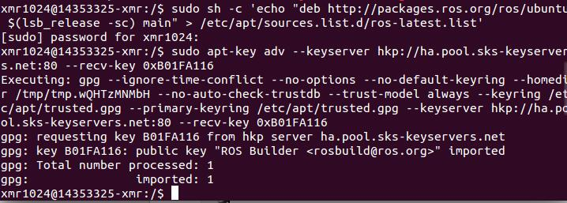
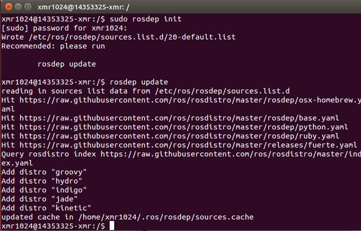

## Lab5 Ubuntu install of ROS Jade ##

### 1.添加sources.list ###

配置电脑使其能够安装来自 packages.ros.org的软件包

`sudo sh -c 'echo "deb http://packages.ros.org/ros/ubuntu $(lsb_release -sc) main" > /etc/apt/sources.list.d/ros-latest.list'`

### 2.添加keys ###

`sudo apt-key adv --keyserver hkp://pool.sks-keyservers.net --recv-key 0xB01FA116`

### 3.安装ROS jade ###

`sudo apt-get install ros-jade-desktop-full`

### 4.初始化rosdep ###

在开始使用ROS之前还需要初始化rosdep。rosdep可以方便需要编译某些源码的时候为其安装一些系统依赖，同时也是某些ROS核心功能组件所必需用到的工具。

`sudo rosdep init`

`rosdep update`

### 5.环境配置 ###

如果每次打开一个新的终端时ROS环境变量都能够自动配置好（即添加到bash会话中），那将会方便很多：

`echo "source /opt/ros/jade/setup.bash" >> ~/.bashrc`

`source ~/.bashrc`

### 6.安装 rosinstall ###

rosinstall是ROS中一个独立分开的常用命令行工具，它可以通过一条命令就可以给某个ROS软件包下载很多源码树。

`sudo apt-get install python-rosinstall`