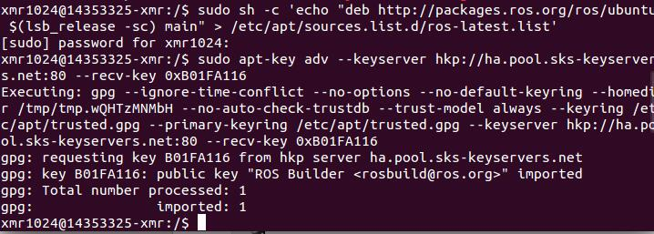
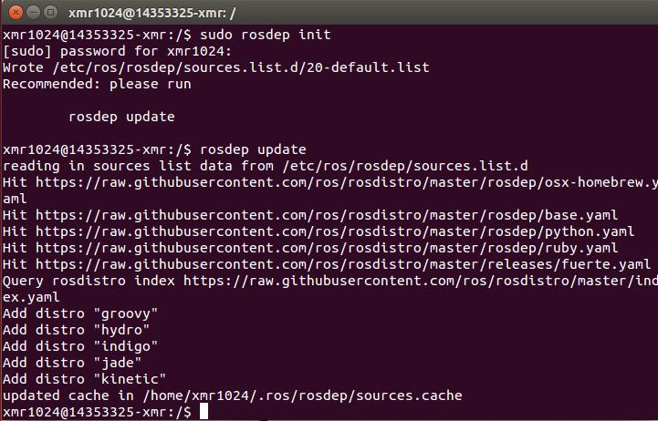
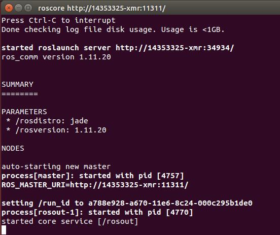
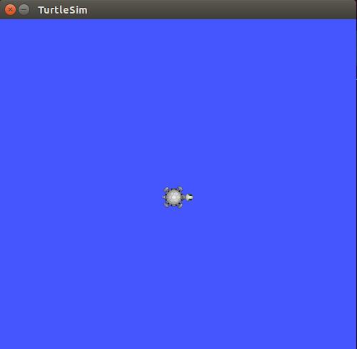
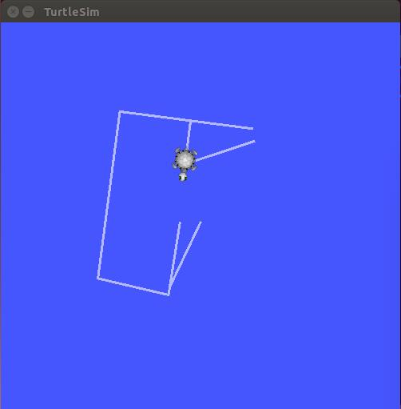
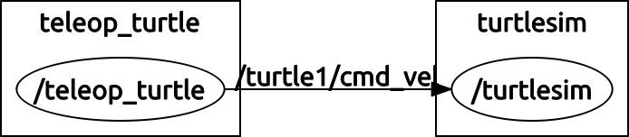
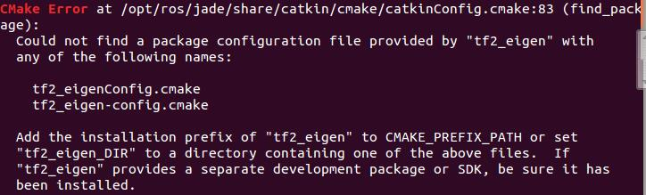
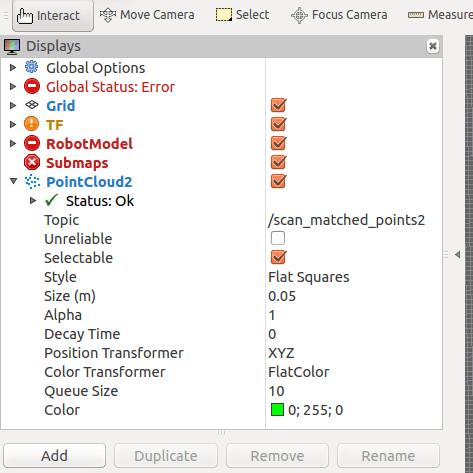
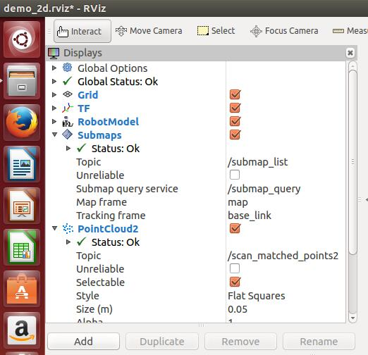
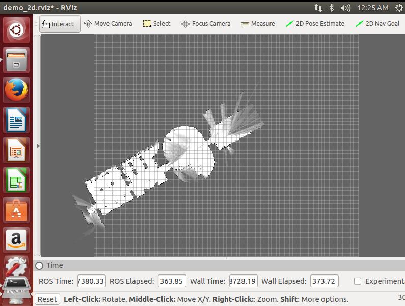

## Lab5 ROS Jade & Cartographer ##

## 一.ROS安装及配置 ##

### 1.添加sources.list ###

配置电脑使其能够安装来自 packages.ros.org的软件包

`sudo sh -c 'echo "deb http://packages.ros.org/ros/ubuntu $(lsb_release -sc) main" > /etc/apt/sources.list.d/ros-latest.list'`

### 2.添加keys ###

`sudo apt-key adv --keyserver hkp://pool.sks-keyservers.net --recv-key 0xB01FA116`

### 3.安装ROS jade ###

`sudo apt-get install ros-jade-desktop-full`

### 4.初始化rosdep ###

在开始使用ROS之前还需要初始化rosdep。rosdep可以方便需要编译某些源码的时候为其安装一些系统依赖，同时也是某些ROS核心功能组件所必需用到的工具。

`sudo rosdep init`

`rosdep update`

### 5.环境配置 ###

如果每次打开一个新的终端时ROS环境变量都能够自动配置好（即添加到bash会话中），那将会方便很多：

`echo "source /opt/ros/jade/setup.bash" >> ~/.bashrc`

`source ~/.bashrc`

### 6.安装 rosinstall ###

rosinstall是ROS中一个独立分开的常用命令行工具，它可以通过一条命令就可以给某个ROS软件包下载很多源码树。

`sudo apt-get install python-rosinstall`

## 二.ROS测试 ##

为了验证ROS安装成功，我们可以运行一个实例。

打开一个终端，输入以下指令

`roscore`

然后会出现以下界面：

打开第二个终端，输入以下指令

`rosrun turtlesim turtlesim_node`

然后会出现一只小乌龟：

打开第三个终端，输入以下指令

`rosrun turtlesim turtle_teleop_key`

可接收键盘输入，用上下左右按键控制乌龟前进轨迹：

打开第四个终端，输入以下指令

`rosrun rqt_graph rqt_graph`

可以看到ROS nodes以及Topic等图形展示：

做到这里，ROS配置验证成功。

## 三.测试Cartographer ##

需要安装3个软件包，ceres solver、cartographer和cartographer_ros

首先安装所有依赖项

`sudo apt-get install -y google-mock libboost-all-dev  libeigen3-dev libgflags-dev libgoogle-glog-dev liblua5.2-dev libprotobuf-dev  libsuitesparse-dev libwebp-dev ninja-build protobuf-compiler python-sphinx  ros-indigo-tf2-eigen libatlas-base-dev libsuitesparse-dev liblapack-dev`

再新建一个文件夹catkin_ws，用于存放新下载及编译的所有东西。

### 1.安装ceres solver ###

进入catkin_ws文件夹路径下，执行以下指令

`git clone https://github.com/hitcm/ceres-solver-1.11.0.git`

进入新出现的ceres-solver-1.11.0文件夹，新建一个build文件夹

`cd ceres-solver-1.11.0/build`

在ceres-solver-1.11.0/build路径下依次执行以下指令

`cmake ..`

`make`

`sudo make install`

ceres solver安装完成

### 2.安装cartographer ###

回到catkin_ws路径下，执行以下指令

`git clone https://github.com/hitcm/cartographer.git`

进入新出现的cartographer文件夹，新建一个build文件夹

`cd cartographer/build`

在cartographer/build路径下依次执行以下指令

`cmake .. -G Ninja`

`ninja`

`ninja test`

`sudo ninja install`

cartographer安装完成

### 3.安装cartographer_ros ###

回到catkin_ws路径下，新建一个src文件夹，进入该路径，执行以下指令

`git clone https://github.com/hitcm/cartographer_ros.git`

回到catkin_ws路径下，执行以下指令

`catkin_make`

执行上条指令时可能会出现不同的报错，例如

这时需要仔细看报错内容，原来是`tf2_eigen`没安装，执行以下指令

`sudo apt-get install ros-jade-tf2-eigen`

若是其他东西没安装，把下载内容换成缺失的东西名称`ros-jade-XXX-YYY`即可

这里必须要保证`catkin_make`执行成功，否则后面的步骤会失败，例如2d图像显示失败

若`catkin_make`执行成功，则cartographer_ros安装完成

### 4.数据下载测试 ###

可选择下载2d数据(500M)或者3d数据(8G)

附下载地址：

`https://storage.googleapis.com/cartographer-public-data/bags/backpack_2d/cartographer_paper_deutsches_museum.bag`

`https://storage.googleapis.com/cartographer-public-data/bags/backpack_3d/cartographer_3d_deutsches_museum.bag`

可把数据包放入home/Downloads路径下

运行launch文件

`roslaunch cartographer_ros demo_backpack_2d.launch bag_filename:=${HOME}/Downloads/cartographer_paper_deutsches_museum.bag`

`roslaunch cartographer_ros demo_backpack_3d.launch bag_filename:=${HOME}/Downloads/cartographer_3d_deutsches_museum.bag`

这里用2d数据测试作为输出结果

首先出来RViz的displays参数界面

各种状态都正常

最终结果如下图

2d的俯视图成功显示，可通过鼠标控制视角方向。

Cartographer测试成功

