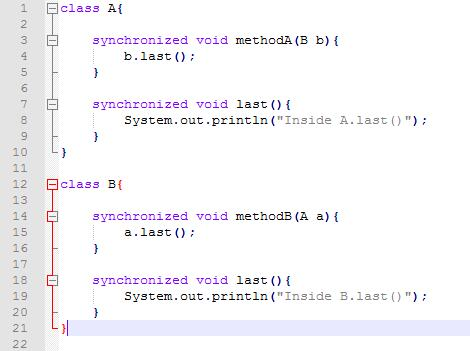
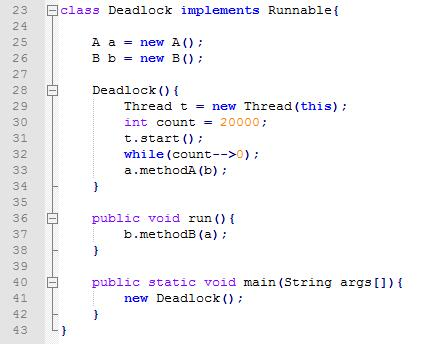
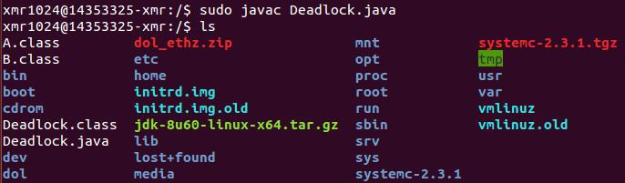
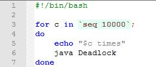
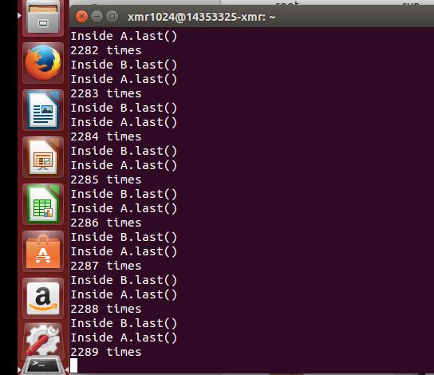

## Deadlock ##

**1.死锁实验截图**

定义一个Deadlock.java文件，写好两个带有synchronized关键字的类A，B

以及类Deadlock

编译上述java文件，会出现三个类

`$	sudo javac Deadlock.java`

写一个执行多次java文件的脚本Deadlock.sh

把脚本放进与上述类同路径中，执行该脚本

`$	sudo sh Deadlock.sh`

当前执行10000次脚本文件，出现死锁的情况：

第2289次出现死锁情况。

**2.产生死锁的四个必要条件**

（1） 互斥条件：一个资源每次只能被一个进程使用。

（2） 请求与保持条件：一个进程因请求资源而阻塞时，对已获得的资源   保持不放。

（3） 不剥夺条件:进程已获得的资源，在末使用完之前，不能强行剥夺。

（4） 循环等待条件:若干进程之间形成一种头尾相接的循环等待资源关系。

**3.程序死锁原因**

  构造两个类A.B的对象a和b，在一个线程t开始创建之后过了某一段时间，主线程会让a调用methodA这个函数，参数是对象b，即让b去执行它的last()函数；而当线程t被调度时，就会执行run()函数，b会调用methodB这个函数，参数是对象a，即让a去执行它的last()函数。

  而类A和B当中的method函数和last函数都带有关键字synchronized，当它用来修饰一个方法或者一个代码块的时候，能够保证在同一时刻最多只有一个线程执行该段代码；当一个线程访问object的一个synchronized同步代码块或同步方法时，其他线程对object中所有其它synchronized同步代码块或同步方法的访问将被阻塞。

  因此，当a.methodA(b)与b.methodB(a)同时执行时，b在methodA函数里要调用自身的b.last()函数，同时b又要为参数a执行methodB函数，如此一来b就不能同时执行自身的两个synchronized关键字函数，因为同一时刻不能有线程同时访问一个对象中的两个及以上synchronized关键字函数。同理a也会有此情况，便形成了死锁的结果，两个线程主线程和线程t都被阻塞。
