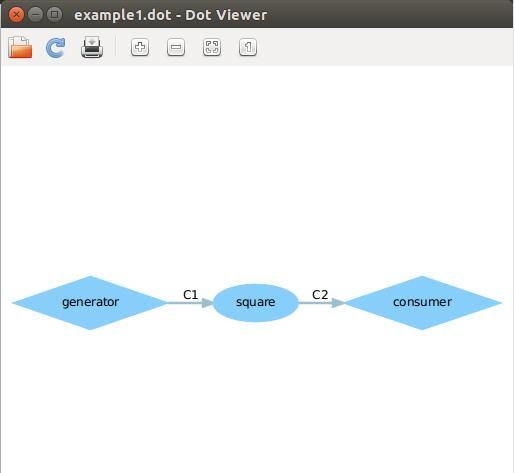
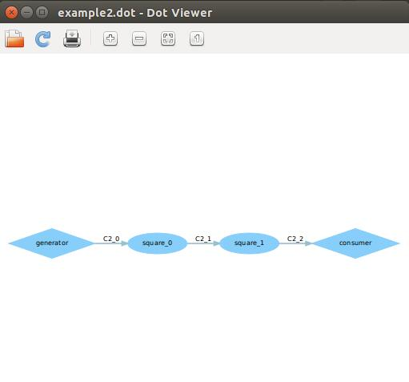
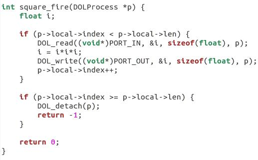
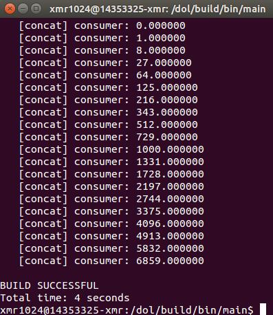
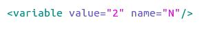
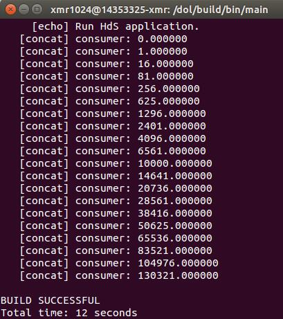

## Lab3 DOL实例分析&编程 ##

### 1.实例dot截图 ###

**(1) example1.dot**

生产者generator产生整数，通过一个square模块(作立方操作)，由consumer输出结果，即某个数的立方。

**(2) example2.dot**

生产者generator产生整数，通过两个square模块(每个模块作平方操作)，由consumer输出结果，即某个数的四次方。

### 2.代码修改 ###

**(1) example1**

使consumer从输出平方数到输出三次方数，需要对square模块的运算进行修改。

首先在dol路径下找到example1文件夹

`$	cd dol/examples/example1`

执行ls命令可以看到有个src文件夹存放各个模块的c代码及头文件

`$	cd src`

进入该文件夹，找到代表square模块的square.c，编辑

`$	sudo gedit square.c`

可以看到square_fire函数里i=i*i，即作平方运算，把它修改成立方运算并保存：

回到dol路径下，将上次实验的build文件夹删除

`$	sudo rm -rf build`

重新编译

`$  sudo ant -f build_zip.xml all`

进入新的build目录下

`$  cd build/bin/main`

运行第一个例子

`$  sudo ant -f runexample.xml -Dnumber=1`

结果如图：

consumer成功输出0到19的三次方

**(2) example2**

使square模块从三个变成两个，需要对example2.xml进行修改。

首先在dol路径下找到example2文件夹

`$	cd dol/examples/example2`

执行ls命令可以看到有个example2.xml文件，编辑

`$	sudo gedit example2.xml`

可以看到整个文件都在围绕N来进行，而N=3，明显就是square模块数量，把它改成2：

进入新的build目录下

`$  cd build/bin/main`

运行第二个例子

`$  sudo ant -f runexample.xml -Dnumber=2`

结果如图：

consumer成功输出0到19的四次方

### 3.实验感想 ###

(1) 对DOL实例有个大概的了解，生产者产生原料，通过通道到中间模块进行目标的加工，加工后通过通道送到消费者中。

(2) 每个模块由其init函数(可无)和fire函数(必有)组成，init函数为初始函数，fire函数可视为执行函数。

(3) 能看懂c文件和xml文件里的大概含义并可作出简单修改。还需要多熟悉代码。